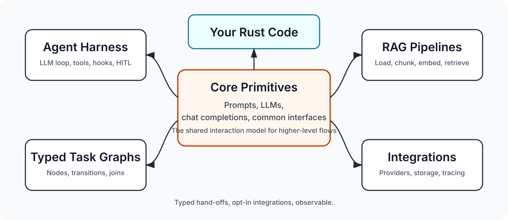

<a name="readme-top"></a>


[![Crate Badge]][Crate]
[![Docs Badge]][API Docs]
[![Contributors][contributors-shield]][contributors-url]
[![Stargazers][stars-shield]][stars-url]

[![MIT License][license-shield]][license-url]
[![LinkedIn][linkedin-shield]][linkedin-url]

<br />
<div align="center">
  <a href="https://github.com/bosun-ai/swiftide">
    
  </a>

  <h1 align="center">Swiftide</h1>

  <p align="center">
    Composable LLM agents, typed task graphs, and streaming RAG pipelines in Rust.
    <br />
    <a href="https://docs.rs/swiftide/latest/swiftide/"><strong>API docs</strong></a>
    ·
    <a href="https://github.com/bosun-ai/swiftide/tree/master/examples"><strong>Examples</strong></a>
    ·
    <a href="https://swiftide.rs"><strong>Website</strong></a>
    ·
    <a href="https://discord.gg/3jjXYen9UY"><strong>Discord</strong></a>
  </p>
</div>

Swiftide is a Rust framework for building LLM applications with tools and workflows. It gives you
an agent harness for tool use, typed task graphs for orchestration, and streaming indexing/query
pipelines for retrieval-heavy applications.

Use Swiftide to keep AI workflows explicit in Rust: tools are normal Rust functions or traits, task
steps have typed inputs and outputs, and integrations are selected through feature flags.

<div align="center">
    
</div>

<details>
  <summary>Table of Contents</summary>

- [Why Swiftide](#why-swiftide)
- [Quick Start](#quick-start)
- [Agent Harness](#agent-harness)
- [Typed Task Graphs](#typed-task-graphs)
- [RAG Pipelines](#rag-pipelines)
- [Integrations](#integrations)
- [Examples](#examples)
- [Project Status](#project-status)
- [Contributing](#contributing)
- [Core Team Members](#core-team-members)
- [License](#license)

</details>

## Why Swiftide

- Build agents that loop over LLM calls, tool calls, lifecycle hooks, and stop conditions.
- Compose prompt steps, agents, command executors, and domain-specific Rust code in typed task
  graphs.
- Fan out work into parallel branches and join typed results back into one task output.
- Pause and resume agents or tasks for human approval, external callbacks, or persisted state.
- Bring tools from local Rust functions, custom `Tool` implementations, or MCP servers.
- Stream large indexing and retrieval workloads through loaders, transformers, embedders, caches,
  and storage backends.
- Trace agent, task, and pipeline execution with `tracing`, metrics, and Langfuse support.

The core primitives provide the shared interaction model. Around them, use pipelines for data
flows, agents for tool loops, and tasks for graphs of typed hand-offs.

## Quick Start

Swiftide keeps default dependencies light. Start with the agent harness and add the integrations
your application needs.

```sh
cargo add swiftide --features swiftide-agents,openai
cargo add anyhow
cargo add tokio --features macros,rt-multi-thread
```

Set the API key expected by the OpenAI-compatible integration:

```sh
export OPENAI_API_KEY=...
```

Use the runnable agent harness example below as your first program.

### Feature recipes

```sh
# Typed task graphs without agent integrations
cargo add swiftide --features swiftide-tasks

# Agents with MCP toolboxes
cargo add swiftide --features swiftide-agents,mcp

# RAG over code or documents with OpenAI, Qdrant, and tree-sitter
cargo add swiftide --features openai,qdrant,tree-sitter
```

## Agent Harness

Agents are the harness for tool-using AI loops. They own message history, call an LLM, invoke tools,
run hooks, and stop when no new messages remain or when a control tool requests it.

```rust
use anyhow::Result;
use swiftide::{
    agents,
    chat_completion::{ToolOutput, errors::ToolError},
    traits::AgentContext,
};

#[swiftide::tool(
    description = "Looks up a Swiftide concept",
    param(name = "concept", description = "Concept to explain")
)]
async fn explain_concept(
    _context: &dyn AgentContext,
    concept: &str,
) -> Result<ToolOutput, ToolError> {
    let explanation = match concept {
        "tasks" => "Tasks compose typed nodes into explicit workflows.",
        "agents" => "Agents run LLM completions, tools, hooks, and stop conditions.",
        "pipelines" => "Pipelines stream data through indexing and retrieval steps.",
        _ => "Swiftide composes agents, task graphs, tools, and RAG pipelines.",
    };

    Ok(explanation.into())
}

#[tokio::main]
async fn main() -> Result<()> {
    let openai = swiftide::integrations::openai::OpenAI::builder()
        .default_prompt_model("gpt-4o-mini")
        .build()?;

    agents::Agent::builder()
        .llm(&openai)
        .tools([explain_concept()])
        .on_new_message(|_, message| {
            println!("{message}");
            Box::pin(async { Ok(()) })
        })
        .limit(8)
        .build()?
        .query("Explain Swiftide tasks and agents in one paragraph.")
        .await?;

    Ok(())
}
```

The agent calls the model, exposes `explain_concept` as a tool, prints new messages, and stops
within the configured turn limit.

Agent capabilities include:

- function tools through `#[swiftide::tool]`, derived tools, or manual `Tool` implementations
- lifecycle hooks before and after completions, tools, messages, streaming chunks, start, and stop
- local or custom `ToolExecutor` implementations for command/file access
- human-in-the-loop approval via `ApprovalRequired` and feedback-aware contexts
- structured stop and failure payloads with custom JSON schemas
- MCP toolboxes that load tools at runtime
- streaming responses and reasoning-item handling for providers that support them

Start with [`examples/hello_agents.rs`](https://github.com/bosun-ai/swiftide/blob/master/examples/hello_agents.rs),
then look at the human approval, MCP, streaming, resume, and structured-output examples.

## Typed Task Graphs

Tasks are Swiftide's orchestration layer. A task is a typed graph of `TaskNode` steps. Each node has
an input type, output type, and error type; transitions decide where the output goes next.

Use tasks when a workflow grows beyond one agent loop: preprocess input, ask an agent for a typed
decision, fan out work, join results, and render the final output.

Core wiring from [`examples/tasks.rs`](https://github.com/bosun-ai/swiftide/blob/master/examples/tasks.rs).
`BriefingAgent` and `BriefingDecision` are defined in that example:

```ignore
use swiftide::{
    prompt::Prompt,
    tasks::{Task, TaskRunOutcome, Transition},
    traits::SimplePrompt,
};
use std::sync::Arc;

let prompt_model: Arc<dyn SimplePrompt> = Arc::new(openai.clone());
let briefing_agent = BriefingAgent::new(agent);
let mut task: Task<Prompt, String> = Task::new();

let brief = task.register_node(prompt_model.clone());
let decide = task.register_node(briefing_agent);
let render = task.register_node(prompt_model);

task.starts_with(brief);
task.register_transition(brief, move |short_brief| {
    decide.transitions_with(short_brief)
})?;
task.register_transition(decide, move |decision: BriefingDecision| {
    Transition::next(
        &render,
        Prompt::from("Write a hand-off note for {{audience}}: {{summary}}")
            .with_context_value("audience", decision.audience)
            .with_context_value("summary", decision.summary),
    )
})?;
task.register_transition(render, task.transitions_to_finish())?;

match task.run(Prompt::from("Summarize the rollout plan")).await? {
    TaskRunOutcome::Completed(note) => println!("{note}"),
    TaskRunOutcome::Paused => println!("Task paused"),
}
```

Task capabilities include:

- closure nodes for small glue steps and `TaskNode` implementations for domain logic
- typed `NodeId` handles, transitions, and join payloads
- static fan-out with explicit joins
- sequential or parallel branch execution
- pause, resume, and reset support
- adapters for prompt-like Swiftide primitives, chat completions, and tool executors
- `TaskAgent` for the simple case where an agent should run as a task node

See [`examples/tasks.rs`](https://github.com/bosun-ai/swiftide/blob/master/examples/tasks.rs) for a
prompt plus custom agent workflow, and
[`examples/tasks_fanout.rs`](https://github.com/bosun-ai/swiftide/blob/master/examples/tasks_fanout.rs)
for fan-out and join.

## RAG Pipelines

Swiftide includes first-class indexing and querying pipelines for retrieval-augmented generation.
Pipelines are streaming and composable: load data, transform it, embed it, cache it, store it, then
retrieve and answer with a typed query flow.

```ignore
use swiftide::{
    indexing::{self, loaders::FileLoader, transformers::{ChunkCode, Embed, MetadataQACode}},
    integrations::qdrant::Qdrant,
};

async fn index(openai: swiftide::integrations::openai::OpenAI) -> anyhow::Result<()> {
    let qdrant = Qdrant::builder()
        .collection_name("swiftide-code")
        .vector_size(1536)
        .batch_size(50)
        .build()?;

    indexing::Pipeline::from_loader(FileLoader::new(".").with_extensions(&["rs"]))
        .with_default_llm_client(openai.clone())
        .then_chunk(ChunkCode::try_for_language_and_chunk_size("rust", 10..2048)?)
        .then(MetadataQACode::default())
        .then_in_batch(Embed::new(openai))
        .then_store_with(qdrant)
        .run()
        .await?;

    Ok(())
}
```

Indexing supports loaders, caches, chunkers, transformers, batch transformers, embedders, and
storage backends. Query pipelines support query transformation, retrieval, response
transformation, answer generation, hybrid search, reranking patterns, and evaluation.

## Integrations

Swiftide integrations are feature-gated so application builds stay intentional.

| Area | Supported integrations |
| --- | --- |
| LLM providers | OpenAI and Azure OpenAI, Anthropic, Gemini, OpenRouter, AWS Bedrock Converse API, Groq, Ollama, Dashscope |
| Tooling | MCP toolboxes, local command execution, custom tool executors |
| Storage and retrieval | Qdrant, Redis, LanceDB, PgVector, DuckDB, Redb |
| Loading data | Files, scraping, Fluvio, Kafka, Parquet, executor-backed file streams |
| Code and text processing | Markdown, text splitting, tree-sitter code chunking and metadata |
| Observability | `tracing`, metrics, Langfuse |

## Examples

The [`examples`](https://github.com/bosun-ai/swiftide/tree/master/examples) crate shows complete
applications for each major workflow.

- Agents: [`hello_agents.rs`](https://github.com/bosun-ai/swiftide/blob/master/examples/hello_agents.rs),
  [`streaming_agents.rs`](https://github.com/bosun-ai/swiftide/blob/master/examples/streaming_agents.rs),
  [`agents_with_human_in_the_loop.rs`](https://github.com/bosun-ai/swiftide/blob/master/examples/agents_with_human_in_the_loop.rs),
  [`agents_mcp_tools.rs`](https://github.com/bosun-ai/swiftide/blob/master/examples/agents_mcp_tools.rs)
- Structured outputs and control tools:
  [`stop_with_args_custom_schema.rs`](https://github.com/bosun-ai/swiftide/blob/master/examples/stop_with_args_custom_schema.rs),
  [`agent_can_fail_custom_schema.rs`](https://github.com/bosun-ai/swiftide/blob/master/examples/agent_can_fail_custom_schema.rs)
- Tasks:
  [`tasks.rs`](https://github.com/bosun-ai/swiftide/blob/master/examples/tasks.rs),
  [`tasks_fanout.rs`](https://github.com/bosun-ai/swiftide/blob/master/examples/tasks_fanout.rs)
- RAG and retrieval:
  [`index_codebase.rs`](https://github.com/bosun-ai/swiftide/blob/master/examples/index_codebase.rs),
  [`query_pipeline.rs`](https://github.com/bosun-ai/swiftide/blob/master/examples/query_pipeline.rs),
  [`hybrid_search.rs`](https://github.com/bosun-ai/swiftide/blob/master/examples/hybrid_search.rs)
- Provider and observability examples:
  [`responses_api.rs`](https://github.com/bosun-ai/swiftide/blob/master/examples/responses_api.rs),
  [`responses_api_reasoning.rs`](https://github.com/bosun-ai/swiftide/blob/master/examples/responses_api_reasoning.rs),
  [`aws_bedrock_agent.rs`](https://github.com/bosun-ai/swiftide/blob/master/examples/aws_bedrock_agent.rs),
  [`langfuse.rs`](https://github.com/bosun-ai/swiftide/blob/master/examples/langfuse.rs)

More background is available on the [Bosun blog](https://blog.bosun.ai/), including posts about
tasks, streaming agents, human-in-the-loop flows, and Rust performance for AI tools.

## Project Status

Swiftide is pre-1.0. APIs can change while the agent harness and task graph APIs settle around
production use. The current API docs and examples are the most reliable source of exact signatures.

Swiftide is part of the [bosun.ai](https://bosun.ai) project.

## Contributing

Contributions are welcome. Read [CONTRIBUTING.md](CONTRIBUTING.md), open an issue for design
discussion, file a
[bug report](https://github.com/bosun-ai/swiftide/issues/new?template=bug_report.md), or propose a
[feature](https://github.com/bosun-ai/swiftide/issues/new?template=feature_request.md). Join the
[Discord](https://discord.gg/3jjXYen9UY) for a faster feedback loop.

Before opening a pull request:

1. Run the focused checks for the crates you changed.
2. Run `cargo +nightly fmt --all -- --check`.
3. Run `cargo clippy --workspace --all-targets --all-features -- -D warnings` when touching shared behavior.
4. Add or update examples, tests, or rustdoc when behavior changes.

AI-generated code is welcome and should be reviewed like any other code. Keep abstractions small,
keep domain logic separate from plumbing, and pay attention to allocations in indexing, querying,
and task execution paths.

AI agents can refer to [AGENTS.md](AGENTS.md) for workspace layout, commands, and expectations.

## Core Team Members

<table>
  <tr>
    <td align="center">
      <a href="https://github.com/timonv">
        
        <br /><sub><b>timonv</b></sub>
        <br /><br />
      </a>
    </td>
    <td align="center">
      <a href="https://github.com/tinco">
        
        <br /><sub><b>tinco</b></sub>
        <br /><br />
      </a>
    </td>
  </tr>
</table>

## License

Distributed under the MIT License. See [LICENSE](LICENSE) for more information.

<p align="right">(<a href="#readme-top">back to top</a>)</p>

[contributors-shield]: https://img.shields.io/github/contributors/bosun-ai/swiftide.svg?style=flat-square
[contributors-url]: https://github.com/bosun-ai/swiftide/graphs/contributors
[stars-shield]: https://img.shields.io/github/stars/bosun-ai/swiftide.svg?style=flat-square
[stars-url]: https://github.com/bosun-ai/swiftide/stargazers
[license-shield]: https://img.shields.io/github/license/bosun-ai/swiftide.svg?style=flat-square
[license-url]: https://github.com/bosun-ai/swiftide/blob/master/LICENSE
[linkedin-shield]: https://img.shields.io/badge/-LinkedIn-black.svg?style=flat-square&logo=linkedin&colorB=555
[linkedin-url]: https://www.linkedin.com/company/bosun-ai
[Crate Badge]: https://img.shields.io/crates/v/swiftide?logo=rust&style=flat-square&logoColor=E05D44&color=E05D44
[Crate]: https://crates.io/crates/swiftide
[Docs Badge]: https://img.shields.io/docsrs/swiftide?logo=rust&style=flat-square&logoColor=E05D44
[API Docs]: https://docs.rs/swiftide
